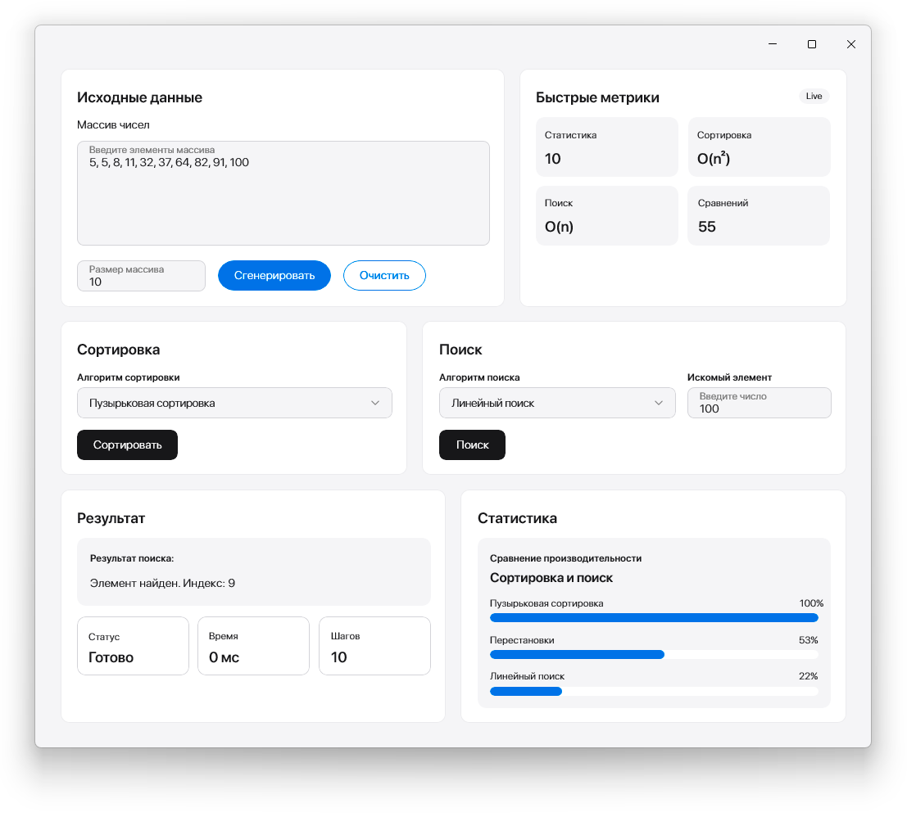

# CourseProject

Приложение для исследования алгоритмов поиска и сортировки с графическим интерфейсом.

## О проекте

Курсовой проект по дисциплине "Объектно-ориентированное программирование".

Программа разработана на языке C++ с использованием WinUI 3 и предназначена для изучения, тестирования и сравнения алгоритмов обработки данных.

Пользователь может:

- вводить массив чисел вручную;
- генерировать случайные данные;
- выполнять сортировку массива;
- выполнять поиска элементов;
- сравнивать алгоритмы по характеристикам;
- получать статистику выполнения операций.

## Реализованные алгоритмы

### Сортировка

- Пузырьковая сортировка
- Сортировка выбором
- Сортировка вставками
- Быстрая сортировка
- Сортировка слиянием

### Поиск

- Линейный поиск
- Бинарный поиск

## Используемые технологии

- C++
- WinUI 3
- XAML
- Visual Studio 2022
- Native Unit Test Framework

## Скриншот программы

